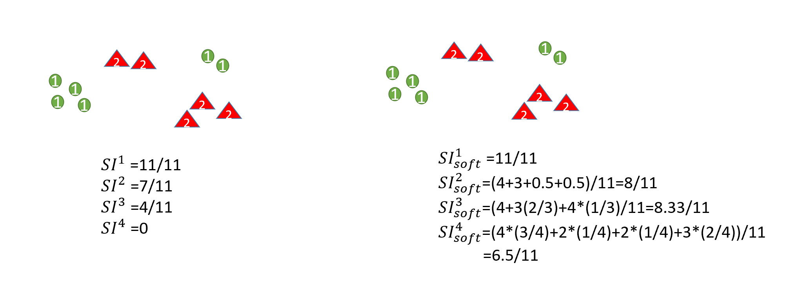
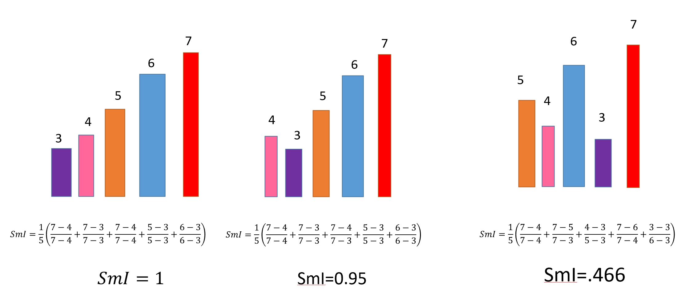

# Data Complexity Measures


<div align="center">

</div>

This repository contains code, examples, and datasets related to data complexity measures, specifically focusing on the following two indices:

1. **Separation Index**: It shows that how much input data points separate the labels from each others.




2. **Smoothness Index**: It shows that how much input data points make the output targets smooth




## Table of Contents

- [Introduction](#introduction)
- [Getting Started](#getting-started)
- [Usage](#usage)
- [Examples](#examples)
- [Data](#data)
- [Contributing](#contributing)
- [License](#license)

## Introduction

Data complexity measures play a crucial role in various machine learning and data analysis tasks. This repository provides implementations and resources for two important complexity indices: Separation Index and Smoothness Index. These indices help in understanding the structure and characteristics of datasets, which can be useful in feature selection, model selection, and data preprocessing.

## Getting Started

To get started with using the code and exploring the data complexity measures, follow these steps:

1. Clone this repository to your local machine:

```bash
git clone https://github.com/Arhosseini77/data_complexity_measures
```


2. Install the required dependencies by running:


```bash
pip install -r requirements.txt
```


3 . Explore the code and documentation in the repository to understand how to use the data complexity measures in your projects.


## Usage
You can use the provided code and functions to calculate Separation Index and Smoothness Index for your datasets. Detailed usage instructions and examples are available in the Examples section below.

## Examples
To see how to use Separation Index and Smoothness Index in practice, refer to the Examples directory. You will find Jupyter Notebook files with step-by-step demonstrations of these measures on sample datasets.

## Data (Soon)
Sample datasets for testing the data complexity measures are available in the data directory. You can use these datasets to experiment with the provided code and to understand how the indices work.

## Contributing
If you'd like to contribute to this project, please follow our contribution guidelines. We welcome contributions in the form of bug reports, feature requests, code improvements, and more.

## License
This project is licensed under the MIT License - see the LICENSE file for details.T
